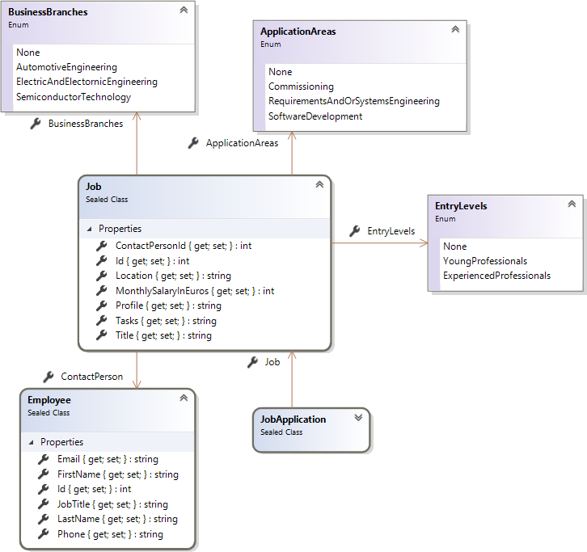
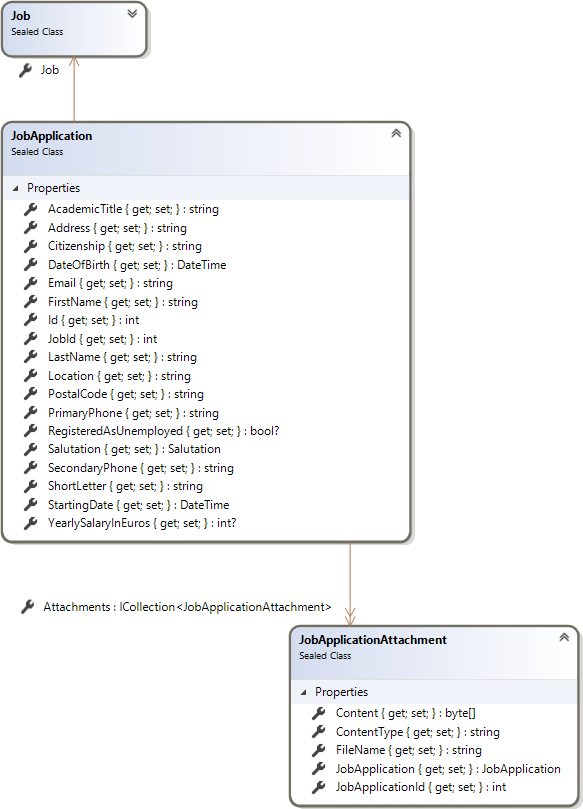

# ALTEN


[](https://github.com/search?q=repo%3Anikita-sharov%2Falten+language%3AC%23&type=Code&ref=advsearch&l=C%23)

This **Git** repository showcases a sample based around creation of job offerings and job applications for the ALTEN Group.

## MVVM

`Job.cd`



`JobViewModelPool.cs`

```csharp
public static readonly JobViewModel YourJob = new JobViewModel
{
    Id = 3461,
    Title = "Software Developer (m/f/d) C#",
    Location = "Graz",
    ApplicationAreas = ApplicationAreas.SoftwareDevelopment,
    BusinessBranches = BusinessBranches.SemiconductorTechnology,
    EntryLevels = EntryLevels.ExperiencedProfessionals,
    Tasks = new List<string>
    {
        "As a Software Developer (m/f/d) C# you are responsible for programming software using C# and .NET",
        "In the course of this you stabilize the TCE architecture and you provide the connection to JAMA",
        "You are responsible for providing advanced functions collecting within user surveys"
    },
    Profile = new List<string>
    {
        "You have a completed technical education in software development, computer science or equivalent",
        "Relevant professional experience with C# are required for this position",
        "You also have Git experience (at least all basic operations)",
        "Moreover, you have a solid WPF knowledge as well as experience with MVVM pattern",
        "Fluent English and basic German skills complete your profile"
    },
    MonthlySalaryInEuros = 3_400,
    ContactPerson = new EmployeeViewModel
    {
        FirstName = "Barbara",
        LastName = "Stankovic",
        JobTitle = "Recruiting Manager",
        Phone = "+43 664 39 85 200",
        Email = "career@alten.at"
    }
};
```

`JobApplication.cd`



`JobApplicationViewModelPool.cs`

```csharp
public static readonly JobApplicationViewModel MyJobApplication = new JobApplicationViewModel
{
    Salutation = Salutation.Mr,
    FirstName = "Nikita",
    LastName = "Sharov",
    Citizenship = "Russian Federation",
    Address = "Mariatroster Straße 172/4",
    PostalCode = "8044",
    Location = "Graz",
    DateOfBirth = DateTime.Parse("14.09.1982"),
    Email = "nikita.sharov@235u.net",
    PrimaryPhone = "+43 664 182 22 83",
    StartingDate = DateTime.Parse("01.06.2020"),
    YearlySalaryInEuros = YourJob.MonthlySalaryInEuros * 14,
    RegisteredAsUnemployed = false,
    Attachments = new List<JobApplicationAttachment>
    {
        new JobApplicationAttachment
        {
            Content = Encoding.UTF8.GetBytes("..."),
            ContentType = MediaTypeNames.Text.Plain,
            FileName = "README.md"
        }
    },
    PrivacyNoteAccepted = true
};
```

## JAMA

```csharp
[TestClass]
public sealed class RestSharpProjectServiceTests
{
    private readonly IProjectService _service = RestSharpServiceFactory.Create<RestSharpProjectService>();

    [TestMethod]
    public async Task EnsureCreatedAsync()
    {
        Project project = await GetOrCreateAsync();
        Assert.IsNotNull(project);
    }

    private async Task<Project> GetOrCreateAsync()
    {
        Project project = await FindProject(key: "HR");
        if (project == null)
        {
            var request = new ProjectRequest
            {
                ProjectKey = "HR",
                Fields = new Dictionary<string, object>
                {
                    [EntityField.Name] = "Recruiting"
                }
            };

            MetaResponse createdResponse = await _service.CreateAsync(request);
            DataResponse<Project> dataResponse = await _service.GetAsync(createdResponse.Meta.Id.Value);
            project = dataResponse.Data;
        }

        return project;
    }

    private async Task<Project> FindProject(string key)
    {
        Project project = null;
        int startAt = 0;
        PageInfo pageInfo = null;
        do
        {
            DataListResponse<Project> dataListResponse = await _service.GetListAsync(
                startAt, JamaOptions.MaxResultsMax);
            project = dataListResponse.Data.SingleOrDefault(p => p.ProjectKey == key);
            if (project != null)
            {
                break;
            }

            pageInfo = dataListResponse.Meta.PageInfo;
            startAt = pageInfo.StartIndex + pageInfo.ResultCount;
        }
        while (startAt < pageInfo.TotalResults);
        return project;
    }
}
```