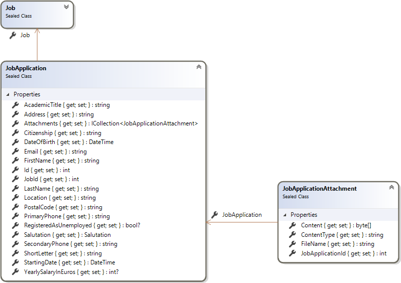

# ALTEN

This repository showcases a sample based around creation of job offerings and job applications for the ALTEN Group.

## Models

`Job.cd`


`JobApplication.cd`



## ViewModels

`TestData.cs`

```csharp
        public static readonly JobViewModel YourJob = new JobViewModel
        {
            Id = 3461,
            Title = "Software Developer (m/f/d) C#",
            Location = "Graz",
            ApplicationAreas = ApplicationAreas.SoftwareDevelopment,
            BusinessBranches = BusinessBranches.SemiconductorTechnology,
            EntryLevels = EntryLevels.ExperiencedProfessionals,
            Tasks = new List<string>
            {
                "As a Software Developer (m/f/d) C# you are responsible for programming software using C# and .NET",
                "In the course of this you stabilize the TCE architecture and you provide the connection to JAMA",
                "You are responsible for providing advanced functions collecting within user surveys"
            },
            Profile = new List<string>
            {
                "You have a completed technical education in software development, computer science or equivalent",
                "Relevant professional experience with C# are required for this position",
                "You also have Git experience (at least all basic operations)",
                "Moreover, you have a solid WPF knowledge as well as experience with MVVM pattern",
                "Fluent English and basic German skills complete your profile"
            },
            MonthlySalaryInEuros = 3_400,
            ContactPerson = new EmployeeViewModel
            {
                FirstName = "Barbara",
                LastName = "Stankovic",
                JobTitle = "Recruiting Manager",
                Phone = "+43 664 39 85 200",
                Email = "career@alten.at"
            }
        };

        public static readonly JobApplicationViewModel MyJobApplication = new JobApplicationViewModel
        {
            Salutation = Salutation.Mr,
            FirstName = "Nikita",
            LastName = "Sharov",
            Citizenship = "Russian Federation",
            Address = "Mariatroster Straße 172/4",
            PostalCode = "8044",
            Location = "Graz",
            DateOfBirth = DateTime.Parse("14.09.1982"),
            Email = "nikita.sharov@235u.net",
            PrimaryPhone = "+43 664 182 22 83",
            StartingDate = DateTime.Parse("01.06.2020"),
            YearlySalaryInEuros = YourJob.MonthlySalaryInEuros * 14,
            RegisteredAsUnemployed = false,
            Attachments = new List<JobApplicationAttachment>
            {
                new JobApplicationAttachment
                {
                    Content = Encoding.UTF8.GetBytes("..."),
                    ContentType = MediaTypeNames.Text.Plain,
                    FileName = "README.md"
                }
            },
            PrivacyNoteAccepted = true
        };
```