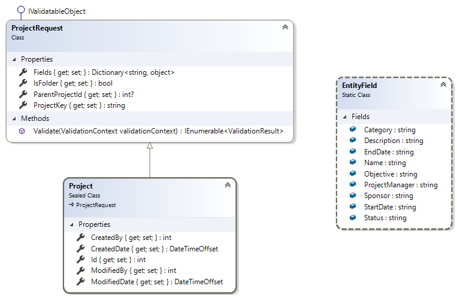
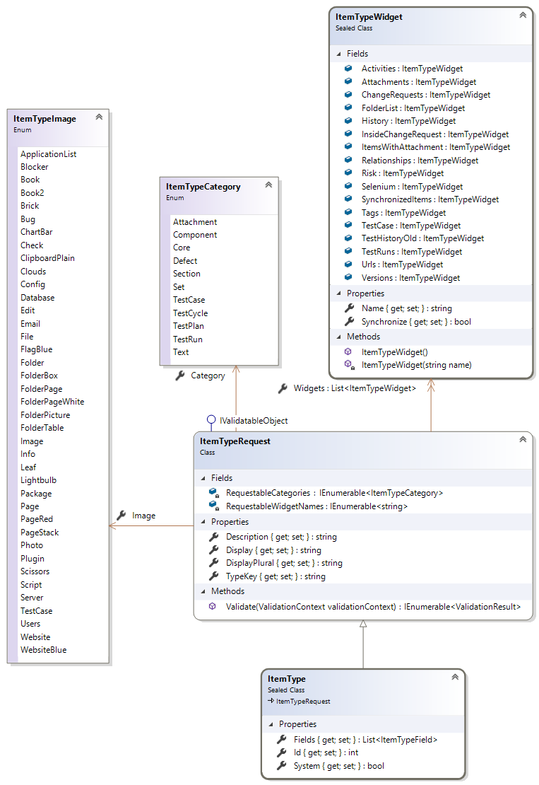
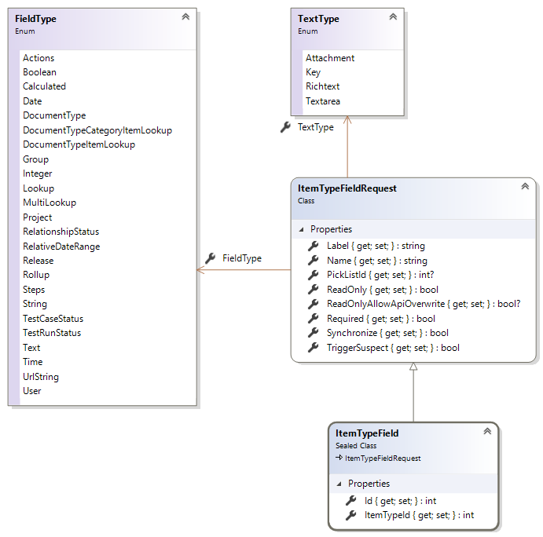
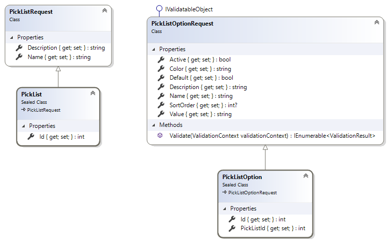
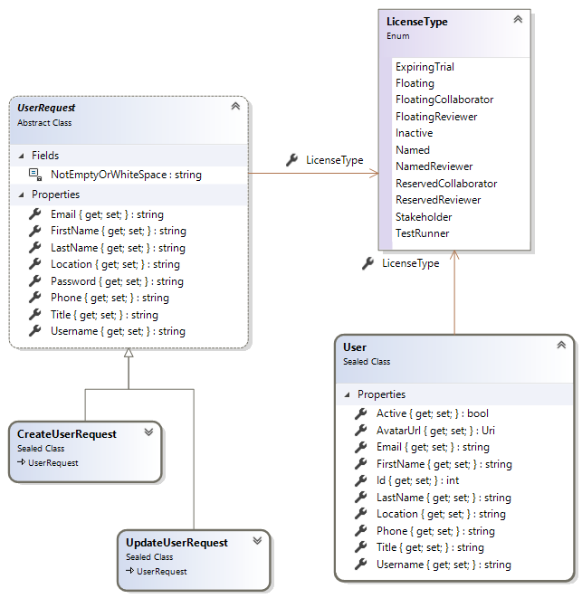
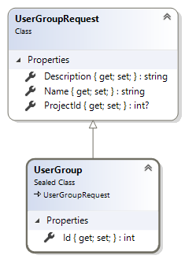

# Jama REST API

```csharp
[TestClass]
public sealed class RestSharpProjectServiceTests
{
    private readonly IProjectService _service = RestSharpServiceFactory.Create<RestSharpProjectService>();

    [TestMethod]
    public async Task EnsureCreatedAsync()
    {
        Project project = await GetOrCreateAsync();
        Assert.IsNotNull(project);
    }

    private async Task<Project> GetOrCreateAsync()
    {
        Project project = await FindProject(key: "HR");
        if (project == null)
        {
            var request = new ProjectRequest
            {
                ProjectKey = "HR",
                Fields = new Dictionary<string, object>
                {
                    [EntityField.Name] = "Recruiting"
                }
            };

            MetaResponse createdResponse = await _service.CreateAsync(request);
            DataResponse<Project> dataResponse = await _service.GetAsync(createdResponse.Meta.Id.Value);
            project = dataResponse.Data;
        }

        return project;
    }

    private async Task<Project> FindProject(string key)
    {
        Project project = null;
        int startAt = 0;
        PageInfo pageInfo = null;
        do
        {
            DataListResponse<Project> dataListResponse = await _service.GetListAsync(
                startAt, JamaOptions.MaxResultsMax);
            project = dataListResponse.Data
                .SingleOrDefault(p => p.ProjectKey.Equals(key, StringComparison.InvariantCultureIgnoreCase));
            if (project != null)
            {
                break;
            }

            pageInfo = dataListResponse.Meta.PageInfo;
            startAt = pageInfo.StartIndex + pageInfo.ResultCount;
        }
        while (startAt < pageInfo.TotalResults);
        return project;
    }
}
```



```csharp
// See: https://rest.jamasoftware.com/#endpoint_projects
public interface IProjectService
{
    Task<MetaResponse> CreateAsync(ProjectRequest body);

    Task<MetaResponse> CreateAttachmentAsync(int projectId, AttachmentRequest body);

    Task<DataResponse<Project>> GetAsync(int projectId);

    Task<DataListResponse<Project>> GetListAsync(int startAt, int maxResults);

    Task<MetaResponse> AddItemTypeAsync(int projectId, int itemTypeId);

    Task<DataListResponse<ItemType>> GetItemTypeListAsync(int projectId, int startAt, int maxResults);

    Task RemoveItemTypeAsync(int projectId, int itemTypeId);

    Task<DataListResponse<Tag>> GetTagListAsync(int projectId, int startAt, int maxResults);

    Task<MetaResponse> UpdateAsync(int projectId, ProjectRequest body);
}
```



```csharp
// See: https://rest.jamasoftware.com/#endpoint_itemtypes
public interface IItemTypeService
{        
    Task<MetaResponse> CreateAsync(ItemTypeRequest body);

    Task<MetaResponse> CreateFieldAsync(int itemTypeId, ItemTypeFieldRequest body);

    Task<DataResponse<ItemType>> GetAsync(int itemTypeId);

    Task<DataListResponse<ItemType>> GetListAsync(int startAt, int maxResults);
}
```



```csharp
// See: https://rest.jamasoftware.com/#endpoint_picklists
public interface IPickListService
{
    Task<MetaResponse> CreateAsync(PickListRequest body);

    Task<MetaResponse> CreateOptionAsync(int pickListId, PickListOptionRequest body);

    Task<DataResponse<PickList>> GetAsync(int pickListId);

    Task<DataListResponse<PickList>> GetListAsync(int startAt, int maxResults);

    Task<DataListResponse<PickListOption>> GetOptionListAsync(int pickListId, int startAt, int maxResults);

    Task DeleteAsync(int pickListId);
}
```



```csharp
// See: https://rest.jamasoftware.com/#endpoint_picklistoptions
public interface IPickListOptionService
{
    Task<DataResponse<PickListOption>> GetAsync(int pickListOptionId);

    Task<MetaResponse> UpdateAsync(int pickListOptionId, PickListOptionRequest body);
}
```



```csharp
// See: https://rest.jamasoftware.com/#endpoint_users
public interface IUserService
{
    Task<MetaResponse> CreateAsync(CreateUserRequest body);

    Task<DataResponse<User>> GetAsync(int userId);

    Task<DataListResponse<User>> GetListAsync(
        string username,
        string email,
        string firstName,
        string lastName,
        LicenseType? licenseType,
        bool includeInactive,
        int startAt,
        int maxResults);

    Task<DataResponse<User>> GetCurrentAsync();

    Task<DataListResponse<Filter>> GetCurrentFilterListAsync(int startAt, int maxResults);

    // See: https://rest.jamasoftware.com/#operation_setActiveStatus
    Task<MetaResponse> ActivateAsync(int userId);

    // See: https://rest.jamasoftware.com/#operation_setActiveStatus
    Task<MetaResponse> DeactivateAsync(int userId);

    /// <summary>
    /// Updates the specified user ignoring <see cref="UserRequest"/>'s properties having null values.
    /// </summary>
    Task<MetaResponse> UpdateAsync(int userId, UpdateUserRequest body);
```



```csharp
// See: https://rest.jamasoftware.com/#endpoint_usergroups
public interface IUserGroupService
{
    Task<MetaResponse> CreateAsync(UserGroupRequest body);

    Task<DataResponse<UserGroup>> GetAsync(int userGroupId);

    Task<DataListResponse<UserGroup>> GetListAsync(int? projectId, int startAt, int maxResults);

    Task<MetaResponse> AddUserAsync(int userGroupId, int userId);

    Task<DataListResponse<User>> GetUserListAsync(int userGroupId, int startAt, int maxResults);

    Task RemoveUserAsync(int userGroupId, int userId);

    Task<MetaResponse> UpdateAsync(int userGroupId, UserGroupRequest body);

    Task DeleteAsync(int userGroupId);
}
```